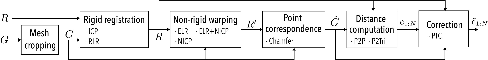

# M3D-FB: Modularized 3D Face Reconstruction Error

A python framework for computing 3D face reconstruction.
<p align="center">
	
</p>

Features of the framework are:
* **Modular**: Fundamental components of error computation are segregated, so that the effect of each component can be observed directly and estimators can be compared fairly
* **Extendable**: Object-oriented design to implement and test custom error computation components
* **Report generation**: Built-in table and plot generators for visual inspection of results, and object-oriented design to facilitate custom report generation
* **Caching**: Per-vertex error on each reconstructed mesh is stored for re-using across various reports
* **Parallelization**: CPU-level parallelization across subjects

## Table of contents: 
1. [Installation and Demo](#installation-and-demo)
1. [Implementing Desired Error Estimator](#implementing-desired-error-estimator)
1. [Building Custom Components](#building-custom-components)
1. [Running an Experiment](#running-an-experiment)
1. [Reporting Experimental Results](#reporting-experimental-results)
1. [Dataset Structure](#dataset-structure)

# Installation and Demo
The framework is installed via `pip` as below (tested on `python 3.8,3.9,3.10,3.11`)
```
pip install --upgrade pip
pip install -r requirements.txt
```

The command below tests the code on a sample toy data (3 meshes, 4 reconstruction methods, 2 error estimators)
```
python run.py info/experiments/results_table-BFMsynth.json ./data/ --num_processes 1
```
The command should take a few minutes to run, and can be sped up by incresing the `--num_processes` value, which controls the number of CPU cores that will be used for error computation. If run successfully, it should return the results below:
```
		True	E1	E12
3DIv2-m     	2.29	1.12	2.13
Deep3DFace-m	2.47	1.23	2.49
INORig-m    	2.82	1.16	2.5
3DDFAv2-m   	3.08	1.3	2.96
```

Results will be cached by default --they will be stored in `./data/cache`--, so re-running the command above should not take more than a few seconds. 

# Implementing desired error estimator

Using M3D-FB, one can implement an error estimator by preparing a JSON file that contains the desired steps in the figure above. The mesh cropping, non-rigid warping and correction steps are optional. For example, the widely used error estimator (ICP+Chamfer) can be implemented as below

```json
{
  "name": "E1",
  "mesh_cropper": null,
  "rigid_aligner":{
    "type": "ICPRigidAligner"
  },
  "nonrigid_aligner": null,
  "distance_computer": {
    "type": "DenseP2PDistance"
  },
  "corr_establisher": {
    "type": "ChamferCorrespondence"
  },
  "corrector": null
}
```
Also, possible optional arguments needed for each step can be provided through the optional "opts" field. For example, rigid landmark-based registration~(RLR) is performed by default using the outer eye corners, inner eye corners and the nose tip, which correspond to the landmarks 13, 19, 28, 31 and 37 of the iBUG-51 model. One can add, say, the inner mouth corners, by updating the field corresponding to rigid alignment as:
```javascript
{
  // ...
  "rigid_aligner":{
    "type": "LandmarkBasedRigidAligner",
    "opts": {
      "ref_lmk_indices": [13, 19, 22, 25, 28, 31, 37]
    }
  }
  // ...
}
```


Below is the list of currently supported alternatives for each step. 

| | Component| Class Name and Initialization|
|--|--|--|
| *Mesh Cropping*${}^\dagger$| PBC | `PointBasedCropper` | 
| *Rigid Alignment*|RLR| `LandmarkBasedRigidAligner` | 
| | ICP| `ICPRigidAligner` |
| *Non-rigid Warping*${}^\dagger$|ELR|`LandmarkBasedNonrigidAligner`|
| |NICP|`NonrigidICPAligner`|
| |ELR+NICP|`NonrigidICPAligner` with `"opts": {"prealign_ELR": 1}`|
| *Point Correspondence*|Chamfer|`ChamferCorrespondence({})`|
| *Distance computation*|P2P|`DenseP2PDistance({})`|
|   |P2Tri|`DenseP2TriDistance({})`|
| *Correction*${}^\dagger$|ETC|`TopologyConsistencyCorrector({})`|

# Building custom components

M3D-FB underlies an object-oriented design, where each component is derived from a base class (see below). Users can build a custom error computation component by deriving a new class from the corresponding base class, which requires only the implementation of the corresponding method (see rightmost column below). These methods take as input a subset of the following arguments (numpy arrays):
* `R`: Reconstructed mesh of size `N×3` 
* `G`: Ground truth mesh of size `M×3` 
* `Rlmks`: Landmark points on reconstructed mesh, `L×3`
* `Glmks`: Landmark points on ground truth mesh, `L×3`

|Component|Base Class|Method|
|--|--|--|
| Mesh Cropping | [`BaseMeshCropper`](facebenchmark/performance_reporters/error_computation/mesh_croppers.py) |`crop()`|
| Rigid Alignment|  [`BaseRigidAligner`](facebenchmark/performance_reporters/error_computation/rigid_aligners.py)|`align()`| 
| Non-rigid Warping |  [`BaseNonrigidAligner`](facebenchmark/performance_reporters/error_computation/nonrigid_aligners.py) |`align()`|
| Point Correspondence |  [`BaseCorrespondenceEstablisher`](facebenchmark/performance_reporters/error_computation/corr_establishers.py) |`establish_correspondence()`|
| Distance computation| [`BaseDistanceComputer`](facebenchmark/performance_reporters/error_computation/distance_computers.py)| `compute()`|
| Correction | [`BaseCorrector`](facebenchmark/performance_reporters/error_computation/correctors.py) |`correct()`|

# Running an Experiment

All experimental analyses in M3D-FB are conducted with the same script, namely`run.py`, which requires two command line arguments:
```python run.py JSON_FILE DATA_DIR --num_processes NUM_PROCESSES}```
The second argument is the path that contains all necessary data, listed as explained by the end of this section. The optional `num_processes` argument controls the number of CPU cores to be used during experiments, and setting it to values larger than 1 enables parallelization across dataset subjects. The first argument is the path to a JSON file that contains all details needed to run the experiment, including the reconstruction methods that are being compared, the error estimators that are being implemented, as well as the type of the report that will be generated. An example JSON file is as below:
```json
{
  "reporter_type": "ResultsTable",
  "reporter_opts": {"weight_threshold": 0.001},
  "rec_methods": [
    "BFM/3DDFAv2",
    "FLAME/RingNet"
  ],
  "mms_info": {
    "BFM": "info/BFM-p23470.json",
    "FLAME": "info/FLAME-face.json"
  },
  "error_computers": [
    "error_computers/E01.json",
    "error_computers/E12.json",
    "error_computers/E16.json"
  ],
  "dataset": {"name": "Florence", "is_synthetic": false}
}
```

This file produces a table (see field `reporter_type`) with the errors of the 3DDFAv2 and RingNet methods on the Florence dataset, produced with the estimators E1, E12 and E16. Of note, once per-vertex error for a subject is estimated, it is cached for re-using later. As such, various reports can be generated without re-computing error. 

# Reporting Experimental Results

M3D-FB has built-in tools for generating tables and plots to report and visualize results. Currently supported tools are as follows (see also figure below)
* `ResultsTable`: Produces a table that compares the errors of multiple reconstruction methods computed with one or more estimators
* `HeatmapVisualizer`: Produces heatmaps showing the error of a reconstruction method on selected subjects with selected estimators
* `CorrelationPlotter`: Plots the true vs. estimated error for multiple reconstruction methods, and reports correlation
* `PerSubjectMetaEvaluator`: Plots the true vs. estimated error for each subject of a dataset, with a different color for each reconstruction methods; and reports the rate of inconsistency for the estimator

<p align="center">
	
</p>

All these reporters are implemented with a class derived from `BaseReporter`. Users can extend the latter to produce their own reporting easily, as the `BaseReporter` class takes care of boilerplate code.

# Dataset Structure

The M3D-FB framework assumes that the data follows a certain format, as explained below. Also, the file format currently supported for meshes is `.txt`; i.e., a text file that contains mesh points (we do not use triangles). Support for alternative formats (e.g., `.obj`) is planned to be added.

All reconstructed meshes and ground truth scans for a dataset are expected to be in the same directory (i.e., `DATA_DIR`). It is assumed that the ground truth meshes and landmarks of, say, the first subject of the Florence dataset, are located below
* `DATA_DIR/Florence/Gmeshes/id0001.txt`
* `DATA_DIR/Florence/Gmeshes/id0001.lmks`

The reconstructed meshes are expected to be listed in a nested directory, structured to specify the mesh topology (e.g., BFM or FLAME) used by the reconstruction method; and the cropping that is used (e.g., the 23,470-point version of BFM) during experiments. For example, the reconstructed mesh for the first subject of the Florence dataset obtained with the 3DDFAv2 method is to be listed at:
* DATA\_DIR/Florence/Rmeshes/BFM/p23470/3DDFAv2/id0001.txt

A [Python script](face_benchmark/utils/convert_mesh.py) is provided to allow users crop reconstructed meshes according to the version of BFM with the 23,470 points.


